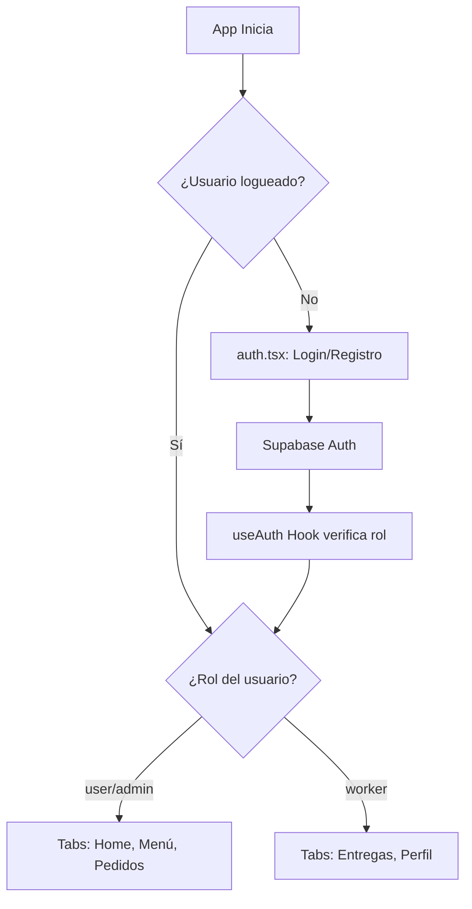
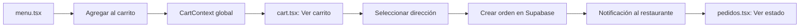
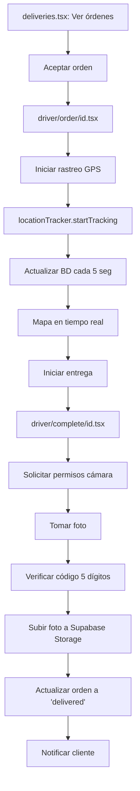
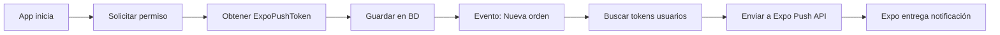

# 📚 GUÍA COMPLETA DE SUSTENTACIÓN - PURA CALLE FOOD

**Tiempo estimado de lectura: 45 minutos**

---

## 🎯 RESUMEN EJECUTIVO (Lee esto primero - 5 min)

### ¿Qué es este proyecto?
Una **aplicación móvil de delivery de comida** con React Native (Expo) que conecta:
- 👥 **Clientes**: Ordenan comida, rastrean en tiempo real, califican
- 🏪 **Restaurantes**: Gestionan menú y órdenes (via admin)
- 🏍️ **Repartidores**: Aceptan órdenes, navegación GPS, foto de entrega

### Tecnologías Principales
- **Frontend**: React Native + Expo (multiplataforma iOS/Android)
- **Backend**: Supabase (PostgreSQL + Auth + Storage + Realtime)
- **Mapas**: Leaflet.js + OpenStreetMap + OSRM para rutas
- **Ubicación**: expo-location (GPS en tiempo real)
- **Cámara**: expo-camera (foto de evidencia)
- **Notificaciones**: expo-notifications (push notifications)

---

## 🧠 CONCEPTOS CLAVE QUE EL PROFESOR PREGUNTARÁ

### ¿QUÉ NOS AHORRA REACT NATIVE?

> [!IMPORTANT]
> **EL PROFESOR PREGUNTARÁ ESTO CON SEGURIDAD**

#### 1. **Write Once, Run Everywhere** 🚀
- **Ahorro**: Un solo código en JavaScript/TypeScript para iOS + Android
- **Alternativa sin RN**: 2 equipos separados (Swift para iOS, Kotlin para Android)
- **Impacto**: 50% menos tiempo y costo de desarrollo

#### 2. **Acceso Nativo Simplificado** 📱
- **Ahorro**: APIs simples para funciones nativas complejas
  ```typescript
  // Con React Native (expo-camera)
  const photo = await cameraRef.current.takePictureAsync();
  
  // Sin RN (nativo Android):
  // - Configurar CameraX, permisos AndroidManifest
  // - Gestionar preview, callbacks, lifecycle
  // - ~200 líneas de código Java/Kotlin
  ```

#### 3. **Hot Reload** ⚡
- **Ahorro**: Cambios instantáneos sin recompilar
- **Alternativa**: Recompilar apps nativas toma 2-5 minutos cada vez
- **Impacto**: 10x más rápido iterar en desarrollo

#### 4. **Ecosistema JavaScript** 🌐
- **Ahorro**: Reutilizar librerías npm (React, TypeScript, utilities)
- **Alternativa**: Aprender lenguajes nativos (Swift, Kotlin)
- **Impacto**: Desarrolladores web pueden crear apps móviles

#### 5. **Expo: Super Powers** 💪
- **Ahorro**: Manejo automático de permisos, build, OTA updates
- **Ejemplo**: 
  ```json
  // app.json - Expo configura permisos automáticamente
  "android": {
    "permissions": ["ACCESS_FINE_LOCATION", "CAMERA"]
  }
  ```
  vs. Android nativo: Editar AndroidManifest.xml + código runtime manualmente

---

## 📂 ARQUITECTURA DEL PROYECTO

### Estructura de Carpetas

```
puracalle-food-nav-entrega-2/
├── app/                    # 🚪 Pantallas (Expo Router file-based routing)
│   ├── _layout.tsx        # ROOT: Layout raíz con providers
│   ├── (tabs)/            # Tab Navigator (Home, Menú, Pedidos, etc.)
│   │   ├── _layout.tsx    # Configuración de tabs
│   │   ├── index.tsx      # Home
│   │   ├── menu.tsx       # Menú de productos
│   │   ├── pedidos.tsx    # Historial de pedidos (cliente)
│   │   ├── deliveries.tsx # Órdenes disponibles (driver)
│   │   └── profile.tsx    # Perfil de usuario
│   ├── driver/            # Pantallas exclusivas del driver
│   │   ├── order/[id].tsx # Ver detalle de orden + mapa tiempo real
│   │   └── complete/[id].tsx # Completar entrega con cámara
│   ├── addresses.tsx      # Gestión de direcciones
│   ├── cart.tsx           # Carrito de compras
│   └── auth.tsx           # Login/Registro
├── components/            # 🎨 Componentes reutilizables
│   ├── RealTimeDeliveryMap.tsx # Mapa con tracking en vivo
│   ├── AddressMapPicker.tsx    # Selector de ubicación
│   └── ui/                # Componentes UI (botones, cards)
├── context/              # 🌐 Estado global (React Context)
│   └── CartContext.tsx   # Carrito de compras global
├── hooks/                # 🪝 Custom Hooks
│   ├── useAuth.ts        # Autenticación y roles
│   └── useNotifications.ts # Push notifications
├── services/             # 🔧 Lógica de negocio y APIs
│   ├── locationTracker.ts    # Rastreo GPS en tiempo real
│   ├── pushNotifications.ts  # Envío de notificaciones
│   ├── products.ts           # CRUD de productos
│   └── addresses.ts          # CRUD de direcciones
├── lib/                  # ⚙️ Configuración
│   └── supabase.ts       # Cliente de Supabase
└── database/             # 🗄️ Esquemas y migraciones SQL
```

---

## 🗺️ FLUJO PRINCIPAL DE LA APLICACIÓN

### 1. INICIO Y AUTENTICACIÓN 🔐



**Archivos involucrados**:
- [`app/auth.tsx`](file:///c:/Users/Tomaas/OneDrive/Documentos/puracalle-food-nav-entrega-2/app/auth.tsx): Pantalla de login
- [`hooks/useAuth.ts`](file:///c:/Users/Tomaas/OneDrive/Documentos/puracalle-food-nav-entrega-2/hooks/useAuth.ts): Gestiona sesión y roles
- [`lib/supabase.ts`](file:///c:/Users/Tomaas/OneDrive/Documentos/puracalle-food-nav-entrega-2/lib/supabase.ts): Cliente configurado

**Código clave**:
```typescript
// hooks/useAuth.ts - Líneas 43-66
useEffect(() => {
  // 1. Obtener sesión al iniciar
  (async () => {
    const { data } = await supabase.auth.getSession();
    setSession(data.session);
    setUser(data.session?.user ?? null);
  })();

  // 2. Escuchar cambios de autenticación
  const { data: subscription } = supabase.auth.onAuthStateChange(
    (_event, newSession) => {
      setSession(newSession);
      setUser(newSession?.user ?? null);
    }
  );
})
```

---

### 2. ORDEN DE COMIDA (Cliente) 🍔



**Archivos involucrados**:
- [`app/(tabs)/menu.tsx`](file:///c:/Users/Tomaas/OneDrive/Documentos/puracalle-food-nav-entrega-2/app/(tabs)/menu.tsx): Catálogo de productos
- [`context/CartContext.tsx`](file:///c:/Users/Tomaas/OneDrive/Documentos/puracalle-food-nav-entrega-2/context/CartContext.tsx): Estado global del carrito
- [`app/cart.tsx`](file:///c:/Users/Tomaas/OneDrive/Documentos/puracalle-food-nav-entrega-2/app/cart.tsx): Checkout y creación de orden
- [`app/addresses.tsx`](file:///c:/Users/Tomaas/OneDrive/Documentos/puracalle-food-nav-entrega-2/app/addresses.tsx): Gestión de direcciones

---

### 3. ENTREGA (Driver) 🏍️📍

> [!WARNING]
> **ESTE ES EL FLUJO MÁS CRÍTICO - EL PROFESOR PREGUNTARÁ EN DETALLE**



**Archivos clave** (¡ESTUDIA ESTOS!):

#### 📍 **Ubicación en Tiempo Real**
[`services/locationTracker.ts`](file:///c:/Users/Tomaas/OneDrive/Documentos/puracalle-food-nav-entrega-2/services/locationTracker.ts)

```typescript
// Líneas 7-55
export const startTracking = async (driverId: string, orderId?: string) => {
  // 1. SOLICITAR PERMISOS
  const { status } = await Location.requestForegroundPermissionsAsync();
  if (status !== 'granted') {
    Alert.alert('Permiso denegado', '...');
    return;
  }

  // 2. INICIAR RASTREO
  locationSubscription = await Location.watchPositionAsync(
    {
      accuracy: Location.Accuracy.High,  // Alta precisión (GPS)
      timeInterval: 5000,                // Actualizar cada 5 segundos
      distanceInterval: 10,              // O cada 10 metros
    },
    async (location) => {
      // 3. GUARDAR EN BD
      const { latitude, longitude, accuracy, heading, speed } = location.coords;
      await supabase.from('driver_locations').insert({
        driver_id: driverId,
        order_id: orderId,
        latitude,
        longitude,
        accuracy,    // Precisión del GPS en metros
        heading,     // Dirección en grados (0-360)
        speed,       // Velocidad en m/s
      });
    }
  );
};
```

**¿Qué permisos solicita?**
- **Android**: `ACCESS_FINE_LOCATION`, `ACCESS_COARSE_LOCATION`
- **iOS**: `NSLocationWhenInUseUsageDescription`
- Configurados en [`app.json`](file:///c:/Users/Tomaas/OneDrive/Documentos/puracalle-food-nav-entrega-2/app.json) líneas 13-32

**¿Qué procesos utiliza?**
1. **GPS del celular**: Obtiene coordenadas (lat/lng)
2. **Listeners de ubicación**: Actualización automática cada 5s o 10m
3. **Supabase Realtime**: Transmite posición al cliente vía WebSocket

---

#### 📸 **Cámara y Foto de Evidencia**
[`app/driver/complete/[id].tsx`](file:///c:/Users/Tomaas/OneDrive/Documentos/puracalle-food-nav-entrega-2/app/driver/complete/[id].tsx)

```typescript
// Líneas 44-57: Solicitar permisos
const [permission, requestPermission] = useCameraPermissions();

React.useEffect(() => {
  if (!permission) {
    requestPermission(); // Solicita permiso automáticamente
  }
}, [permission]);

// Líneas 79-100: Tomar foto
const takePicture = async () => {
  if (cameraRef.current) {
    const photo = await cameraRef.current.takePictureAsync({
      quality: 0.7,   // Comprimir al 70%
      base64: true,   // Obtener base64 para subir
    });
    setPhoto(photo.uri);
    setPhotoBase64(photo.base64);
  }
};

// Líneas 107-209: Confirmar entrega
const confirmDelivery = async () => {
  // 1. Validar código de 5 dígitos
  if (deliveryCode !== orderCode) {
    Alert.alert('❌ Código Incorrecto');
    return;
  }

  // 2. Subir foto a Supabase Storage
  const photoName = `delivery-${orderId}-${Date.now()}.jpg`;
  await supabase.storage
    .from('delivery-photos')
    .upload(photoName, decode(photoBase64), {
      contentType: 'image/jpeg',
    });

  // 3. Registrar en BD
  await supabase.from('delivery_photos').insert({
    order_id: orderId,
    driver_id: user.id,
    photo_url: photoName,
  });

  // 4. Actualizar orden
  await supabase.from('orders').update({
    status: 'completed',
    status_detailed: 'delivered',
    delivered_at: new Date().toISOString(),
  });

  // 5. Notificar cliente
  await notifyOrderStatusChange(userId, orderId, 'delivered');
};
```

**¿Qué permisos solicita?**
- **Android**: `CAMERA` (automático con expo-camera)
- **iOS**: `NSCameraUsageDescription` (en app.json)

**¿Qué procesos utiliza?**
1. **Acceso a la cámara**: Captura imagen nativa
2. **Compresión**: Reduce tamaño (70% quality)
3. **Base64 encoding**: Convierte imagen a texto para subir
4. **Supabase Storage**: Almacena archivo en la nube

**¿Qué nos ahorra React Native?**
```
SIN React Native (Android nativo):
- Configurar CameraX
- Gestionar permisos runtime (ActivityCompat.requestPermissions)
- Manejar lifecycle (onPause, onResume)
- Crear preview surface
- Codificar a base64 manualmente
Total: ~300 líneas de Java/Kotlin

CON React Native:
- import { CameraView, useCameraPermissions } from 'expo-camera';
- await cameraRef.current.takePictureAsync({ base64: true });
Total: ~50 líneas de TypeScript
```

---

#### 🗺️ **Mapa en Tiempo Real**
[`components/RealTimeDeliveryMap.tsx`](file:///c:/Users/Tomaas/OneDrive/Documentos/puracalle-food-nav-entrega-2/components/RealTimeDeliveryMap.tsx)

**Tecnología**: WebView + Leaflet.js (JavaScript para mapas web)

**¿Por qué WebView y no React Native Maps?**
- React Native Maps: Depende de Google Maps API ($$$)
- Nuestra solución: OpenStreetMap (GRATIS) + Leaflet (open source)

**Flujo**:
1. **Renderizar HTML con Leaflet** dentro de `<WebView>`
2. **Actualizar ubicación del driver** via JavaScript injection
3. **Calcular ruta en tiempo real** con OSRM API (Open Source Routing Machine)
4. **Mostrar marcadores**:
   - 🏠 Cliente (verde)
   - 🏍️ Driver (naranja)
   - 🏪 Restaurante (azul)

```typescript
// Líneas 47-54: Actualización en tiempo real
useEffect(() => {
  if (webViewRef.current && mapReady && driverLocation) {
    // Inyectar JavaScript para mover el marcador del driver
    webViewRef.current.injectJavaScript(`
      updateDriverLocation(${driverLocation.latitude}, ${driverLocation.longitude});
      true;
    `);
  }
}, [driverLocation]);
```

---

## 🔄 CÓMO ESTÁN INTERCONECTADOS LOS COMPONENTES

### 1. Providers y Contextos (Estado Global)

```
app/_layout.tsx (ROOT)
  └─ SafeAreaProvider
      └─ ThemeProvider (React Navigation)
          └─ CartProvider (context/CartContext.tsx)
              └─ Stack Navigator
                  └─ (tabs)/_layout.tsx
                      └─ Tabs Navigator (tabs condicionales según rol)
```

**Explicación**:
- **SafeAreaProvider**: Maneja áreas seguras (notch, barra de estado)
- **ThemeProvider**: Tema claro/oscuro
- **CartProvider**: Estado global del carrito (accesible desde cualquier pantalla)

---

### 2. Navegación (Expo Router)

**Expo Router = File-based routing** (como Next.js)

```
app/
  ├── _layout.tsx           → Layout raíz
  ├── (tabs)/
  │   ├── _layout.tsx       → Tab Navigator
  │   ├── index.tsx         → /(tabs)/  (Home)
  │   ├── menu.tsx          → /(tabs)/menu
  │   └── pedidos.tsx       → /(tabs)/pedidos
  ├── cart.tsx              → /cart (Modal)
  └── driver/
      └── order/
          └── [id].tsx      → /driver/order/123 (Dynamic route)
```

**Navegación programática**:
```typescript
import { router } from 'expo-router';

// Ir a pantalla
router.push('/cart');

// Ir con parámetros
router.push(`/driver/order/${orderId}`);

// Volver
router.back();

// Reemplazar (no permite volver)
router.replace('/(tabs)/deliveries');
```

---

### 3. Comunicación con Supabase (Base de Datos)

**Supabase = Backend as a Service**
- **PostgreSQL**: Base de datos relacional
- **Auth**: Autenticación con JWT
- **Storage**: Almacenamiento de archivos (fotos)
- **Realtime**: WebSockets para actualizaciones en vivo

**Ejemplo: Crear orden**
```typescript
// app/cart.tsx - Líneas ~200-250
const { data: order, error } = await supabase
  .from('orders')
  .insert({
    user_id: user.id,
    restaurant_id: 'some-id',
    address_id: selectedAddressId,
    total_cents: totalCents,
    status: 'pending',
    status_detailed: 'pending_payment',
  })
  .select()
  .single();
```

**Realtime Subscriptions** (Actualizaciones en vivo):
```typescript
// app/driver/order/[id].tsx - Líneas 72-93
const channel = supabase
  .channel(`order-${id}`)
  .on(
    'postgres_changes',
    {
      event: 'UPDATE',
      schema: 'public',
      table: 'orders',
      filter: `id=eq.${id}`,
    },
    (payload) => {
      // Reaccionar a cambios en la orden (ej: cancelación)
      if (payload.new.status_detailed === 'cancelled') {
        Alert.alert('Orden Cancelada');
        router.replace('/(tabs)/deliveries');
      }
    }
  )
  .subscribe();
```

---

## 🛠️ SAFE AREA Y SAFE AREA BORDERS

> [!TIP]
> **SafeAreaView**: Componente de `react-native-safe-area-context` que evita que el contenido quede debajo del notch, barra de estado o botones del sistema.

### ¿Cuándo usamos SafeAreaView?

**Todas las pantallas principales**:
```typescript
import { SafeAreaView } from 'react-native-safe-area-context';

export default function MyScreen() {
  return (
    <SafeAreaView style={styles.container}>
      {/* Contenido seguro */}
    </SafeAreaView>
  );
}
```

### Parámetro `edges`
```typescript
// Proteger solo arriba (top) - Útil cuando hay header
<SafeAreaView edges={['top']} style={styles.container}>

// Proteger todo (predeterminado)
<SafeAreaView style={styles.container}>

// No proteger abajo (cuando hay tab bar)
<SafeAreaView edges={['top', 'left', 'right']} style={styles.container}>
```

**Ejemplo real**: [`app/driver/order/[id].tsx` línea 369](file:///c:/Users/Tomaas/OneDrive/Documentos/puracalle-food-nav-entrega-2/app/driver/order/[id].tsx#L369)
```typescript
<SafeAreaView style={styles.container} edges={['top']}>
  {/* Solo protege arriba porque abajo tenemos botones fijos */}
</SafeAreaView>
```

### useSafeAreaInsets (más control)
```typescript
import { useSafeAreaInsets } from 'react-native-safe-area-context';

const insets = useSafeAreaInsets();

// Uso en tabs para ajustar altura
<View style={{
  paddingBottom: Math.max(insets.bottom, 5),
  height: 60 + Math.max(insets.bottom, 5),
}}>
```

**Ejemplo real**: [`app/(tabs)/_layout.tsx` líneas 16-31](file:///c:/Users/Tomaas/OneDrive/Documentos/puracalle-food-nav-entrega-2/app/(tabs)/_layout.tsx#L16-L31)

---

## 📢 NOTIFICACIONES PUSH

[`services/pushNotifications.ts`](file:///c:/Users/Tomaas/OneDrive/Documentos/puracalle-food-nav-entrega-2/services/pushNotifications.ts)

### ¿Cómo funcionan?



### Código clave

**1. Registrar token**:
```typescript
// hooks/useNotifications.ts
const token = await Notifications.getExpoPushTokenAsync();
await supabase
  .from('push_tokens')
  .upsert({ user_id: user.id, token: token.data });
```

**2. Enviar notificación**:
```typescript
// services/pushNotifications.ts - Líneas 80-120
export async function notifyOrderStatusChange(
  userId: string,
  orderId: string,
  newStatus: string
) {
  // 1. Buscar token del usuario
  const { data: tokens } = await supabase
    .from('push_tokens')
    .select('token')
    .eq('user_id', userId);

  // 2. Construir mensaje
  const message = {
    to: tokens.map(t => t.token),
    sound: 'default',
    title: '📦 Actualización de Orden',
    body: `Tu orden está: ${statusMap[newStatus]}`,
    data: { orderId, status: newStatus },
  };

  // 3. Enviar a Expo Push API
  await fetch('https://exp.host/--/api/v2/push/send', {
    method: 'POST',
    headers: { 'Content-Type': 'application/json' },
    body: JSON.stringify(message),
  });
}
```

### ¿Por dónde pasan?
1. **App** → Solicita token a Expo
2. **Expo** → Genera token único
3. **App** → Guarda token en Supabase
4. **Backend (Supabase Function)** → Trigger cuando cambia orden
5. **Expo Push Service** → Enruta a FCM (Android) o APNs (iOS)
6. **Sistema Operativo** → Muestra notificación

### ¿Qué nos ahorra React Native?
```
SIN React Native:
- Android: Configurar Firebase Cloud Messaging (FCM)
  - google-services.json, Firebase SDK
  - Service para recibir notificaciones
- iOS: Configurar APNs
  - Certificados push, provisioning profiles
  - UserNotifications framework
Total: ~500 líneas de código + configuración compleja

CON React Native (Expo):
- expo install expo-notifications
- Notifications.getExpoPushTokenAsync()
- Expo maneja FCM y APNs automáticamente
Total: ~100 líneas
```

---

## 🗂️ TABS: NAVEGACIÓN CONDICIONAL

[`app/(tabs)/_layout.tsx`](file:///c:/Users/Tomaas/OneDrive/Documentos/puracalle-food-nav-entrega-2/app/(tabs)/_layout.tsx)

### ¿Cómo funcionan?

**React Navigation Bottom Tabs** renderiza pestañas en la parte inferior.

**Condicionalidad según rol**:
```typescript
const { role } = useAuth();
const isWorker = role === 'worker';

// Líneas 42-77: Tabs condicionales
<Tabs.Screen
  name="menu"
  options={{
    title: 'Menú',
    href: isWorker ? null : undefined,  // null = ocultar
  }}
/>

<Tabs.Screen
  name="deliveries"
  options={{
    title: 'Entregas',
    href: isWorker ? undefined : null,  // undefined = mostrar
  }}
/>
```

**Resultado**:
- **Usuario normal**: Ve Home, Menú, Pedidos, Promos, Perfil
- **Worker**: Ve solo Entregas y Perfil

---

## 🎨 POP-UPS Y MODALES

### 1. **Alert** (Nativo de React Native)
```typescript
import { Alert } from 'react-native';

Alert.alert(
  '⚠️ Título',
  'Mensaje',
  [
    { text: 'Cancelar', style: 'cancel' },
    { text: 'OK', onPress: () => console.log('OK') }
  ]
);
```

### 2. **Modal Screen** (Expo Router)
```typescript
// app/modal.tsx
export default function ModalScreen() {
  return <View><Text>Soy un modal</Text></View>;
}

// Configurado en app/_layout.tsx
<Stack.Screen name="modal" options={{ presentation: 'modal' }} />

// Abrir desde cualquier pantalla
router.push('/modal');
```

### 3. **Custom Bottom Sheet** (ejemplo en cart.tsx)
- Posición absoluta con animaciones
- Overlay semi-transparente
- Gestos de arrastre (opcional)

---

## 💾 LLAMADO A BASE DE DATOS Y APIs

### Supabase Client Pattern

**Todas las operaciones siguen el mismo patrón**:
```typescript
// 1. SELECT (Leer)
const { data, error } = await supabase
  .from('table_name')
  .select('column1, column2, relation!foreign_key(col)')
  .eq('id', someId)
  .single();

// 2. INSERT (Crear)
const { data, error } = await supabase
  .from('table_name')
  .insert({ column: 'value' })
  .select()
  .single();

// 3. UPDATE (Actualizar)
const { error } = await supabase
  .from('table_name')
  .update({ column: 'new_value' })
  .eq('id', someId);

// 4. DELETE (Eliminar)
const { error } = await supabase
  .from('table_name')
  .delete()
  .eq('id', someId);
```

### Ejemplo Real: Cargar orden del driver

[`app/driver/order/[id].tsx` líneas 182-261](file:///c:/Users/Tomaas/OneDrive/Documentos/puracalle-food-nav-entrega-2/app/driver/order/[id].tsx#L182-L261)

```typescript
const loadOrder = async () => {
  const { data, error } = await supabase
    .from('orders')
    .select(`
      *,
      profiles!user_id (full_name, email, phone),
      addresses!fk_orders_addresses (address_line, latitude, longitude)
    `)
    .eq('id', id)
    .single();

  if (error) throw error;
  setOrder(data);
};
```

**Explicación**:
- `orders`: Tabla principal
- `profiles!user_id`: JOIN con tabla profiles usando foreign key `user_id`
- `addresses!fk_orders_addresses`: JOIN con tabla addresses

---

## ⚡ APIS EXTERNAS

### 1. OSRM (Open Source Routing Machine)
**Propósito**: Calcular rutas entre driver y cliente

```typescript
// components/RealTimeDeliveryMap.tsx - Líneas 205-233
const url = `https://router.project-osrm.org/route/v1/driving/${driverLng},${driverLat};${customerLng},${customerLat}?overview=full&geometries=geojson`;
const response = await fetch(url);
const data = await response.json();

// Retorna: Coordenadas de la ruta óptima
const coordinates = data.routes[0].geometry.coordinates;
```

### 2. Expo Push API
**Propósito**: Enviar notificaciones push

```typescript
// services/pushNotifications.ts - Líneas 105-115
await fetch('https://exp.host/--/api/v2/push/send', {
  method: 'POST',
  headers: { 'Content-Type': 'application/json' },
  body: JSON.stringify({
    to: pushToken,
    title: 'Nueva Orden',
    body: 'Tienes una orden pendiente',
  }),
});
```

---

## 🎯 PREGUNTAS FRECUENTES DEL PROFESOR

### 1. ¿Cómo funciona la cámara?

**Respuesta**:
1. Importamos `expo-camera` que envuelve APIs nativas
2. Solicitamos permiso con `useCameraPermissions()`
3. Renderizamos `<CameraView>` con ref
4. Llamamos `cameraRef.current.takePictureAsync({ base64: true })`
5. Obtenemos URI y base64 de la foto
6. Subimos a Supabase Storage con `decode(base64)`

**Permisos**: `CAMERA` (Android), `NSCameraUsageDescription` (iOS)

**Qué ahorra RN**: ~200 líneas de código nativo para configurar preview, lifecycle, permisos runtime

---

### 2. ¿Cómo funciona la ubicación en tiempo real?

**Respuesta**:
1. Importamos `expo-location`
2. Solicitamos permiso con `requestForegroundPermissionsAsync()`
3. Iniciamos rastreo con `watchPositionAsync()`:
   - Precisión: `High` (usa GPS)
   - Intervalo: 5 segundos o 10 metros
4. Callback recibe coordenadas cada actualización
5. Guardamos en tabla `driver_locations` en Supabase
6. Cliente se suscribe a cambios con Supabase Realtime
7. Mapa se actualiza automáticamente via WebView injection

**Permisos**: `ACCESS_FINE_LOCATION` (Android), `NSLocationWhenInUseUsageDescription` (iOS)

**Qué ahorra RN**: Manejo manual de LocationManager (Android) o CLLocationManager (iOS), permisos runtime, listeners

---

### 3. ¿Qué es Supabase y por qué lo usamos?

**Respuesta**:
- **Backend as a Service** (como Firebase pero open source)
- Incluye:
  - PostgreSQL (base de datos relacional)
  - Row Level Security (seguridad granular)
  - Realtime via WebSockets
  - Storage para archivos
  - Auth con JWT
- **Ventaja**: No necesitamos servidor propio, todo está en la nube
- **Costo**: Plan gratuito generoso (50,000 usuarios)

---

### 4. ¿Cómo se organizan los tabs?

**Respuesta**:
- Usamos **React Navigation Bottom Tabs**
- Configurado en `app/(tabs)/_layout.tsx`
- Tabs condicionales según rol del usuario:
  - `href: null` oculta el tab
  - `href: undefined` muestra el tab
- Iconos con `lucide-react-native`
- Safe area con `useSafeAreaInsets()` para ajustar padding

---

### 5. ¿Cómo funcionan las notificaciones?

**Respuesta**:
1. **Registro**: App obtiene Expo Push Token y lo guarda en BD
2. **Trigger**: Evento en Supabase (ej: nueva orden)
3. **Backend**: Busca tokens de usuarios objetivo
4. **Envío**: POST a Expo Push API
5. **Enrutamiento**: Expo lo envía a FCM (Android) o APNs (iOS)
6. **Entrega**: Sistema operativo muestra la notificación

**Servicios externos**: Firebase Cloud Messaging (Android), Apple Push Notification Service (iOS) - Manejados automáticamente por Expo

---

## 📝 CHECKLIST FINAL PRE-SUSTENTACIÓN

- [ ] **Arquitectura**: Puedo explicar carpeta `app`, `components`, `services`, `hooks`
- [ ] **Flujo de orden**: Cliente ordena → Driver acepta → Tracking → Entrega con foto
- [ ] **Ubicación GPS**: 
  - [ ] Sé qué permisos solicita (`ACCESS_FINE_LOCATION`, etc.)
  - [ ] Sé cómo funciona `watchPositionAsync` (intervalos, precisión)
  - [ ] Qué ahorra RN (envuelve LocationManager nativo)
- [ ] **Cámara**:
  - [ ] Sé qué permisos solicita (`CAMERA`, `NSCameraUsageDescription`)
  - [ ] Proceso: requestPermission → CameraView → takePictureAsync → base64
  - [ ] Qué ahorra RN (no configurar CameraX manualmente)
- [ ] **Supabase**: 
  - [ ] Es un BaaS (Backend as a Service)
  - [ ] PostgreSQL + Auth + Storage + Realtime
  - [ ] Patrón: `supabase.from('table').select().eq()`
- [ ] **Tabs**: Condicionales con `href: null` según rol
- [ ] **Safe Area**: `SafeAreaView` evita notch, uso de `edges` prop
- [ ] **Notificaciones**: Expo Push Token → Expo API → FCM/APNs
- [ ] **Qué ahorra React Native**: 
  - [ ] Write once, run everywhere
  - [ ] APIs nativas simplificadas
  - [ ] Hot reload
  - [ ] Ecosistema JavaScript
  - [ ] Expo maneja permisos/builds

---

## 🎓 TIPS PARA LA SUSTENTACIÓN

1. **Enfócate en el código del driver**: Es lo más complejo y lo que el profesor más preguntará
2. **Ten la app corriendo en tu celular**: Muestra primero, explica después
3. **Graba un video de respaldo**: Por si algo falla en vivo
4. **Practica explicar sin mirar código**: Demuestra que entiendes, no memorizaste
5. **Prepara respuestas cortas**: Directo al grano, el tiempo es limitado
6. **Si no sabes algo**: "No estoy seguro, pero puedo investigar..." es mejor que inventar

---

## 📚 ARCHIVOS CRÍTICOS PARA REPASAR

1. [`app/_layout.tsx`](file:///c:/Users/Tomaas/OneDrive/Documentos/puracalle-food-nav-entrega-2/app/_layout.tsx) - Raíz de la app
2. [`app/(tabs)/_layout.tsx`](file:///c:/Users/Tomaas/OneDrive/Documentos/puracalle-food-nav-entrega-2/app/(tabs)/_layout.tsx) - Tabs condicionales
3. [`app/driver/order/[id].tsx`](file:///c:/Users/Tomaas/OneDrive/Documentos/puracalle-food-nav-entrega-2/app/driver/order/[id].tsx) - Detalle orden + GPS
4. [`app/driver/complete/[id].tsx`](file:///c:/Users/Tomaas/OneDrive/Documentos/puracalle-food-nav-entrega-2/app/driver/complete/[id].tsx) - Cámara + código
5. [`services/locationTracker.ts`](file:///c:/Users/Tomaas/OneDrive/Documentos/puracalle-food-nav-entrega-2/services/locationTracker.ts) - Rastreo GPS
6. [`components/RealTimeDeliveryMap.tsx`](file:///c:/Users/Tomaas/OneDrive/Documentos/puracalle-food-nav-entrega-2/components/RealTimeDeliveryMap.tsx) - Mapa en vivo
7. [`hooks/useAuth.ts`](file:///c:/Users/Tomaas/OneDrive/Documentos/puracalle-food-nav-entrega-2/hooks/useAuth.ts) - Autenticación
8. [`context/CartContext.tsx`](file:///c:/Users/Tomaas/OneDrive/Documentos/puracalle-food-nav-entrega-2/context/CartContext.tsx) - Estado global
9. [`services/pushNotifications.ts`](file:///c:/Users/Tomaas/OneDrive/Documentos/puracalle-food-nav-entrega-2/services/pushNotifications.ts) - Notificaciones

---

## ✅ RESUMEN ULTRA-RÁPIDO (5 min antes de entrar)

**¿Qué es?** App de delivery móvil React Native + Expo + Supabase

**Tecnologías clave**:
- Frontend: React Native (iOS/Android con un código)
- Backend: Supabase (PostgreSQL + Auth + Storage + Realtime)
- Mapas: Leaflet + OpenStreetMap
- GPS: expo-location (cada 5s o 10m)
- Cámara: expo-camera (foto evidencia)

**Flujo crítico (Driver)**:
1. Ver órdenes → Aceptar
2. Iniciar GPS tracking → Actualiza BD cada 5s
3. Mapa tiempo real vía WebSocket
4. Completar: Pedir código 5 dígitos + Foto
5. Subir a Storage → Actualizar orden → Notificar

**Permisos**:
- Ubicación: `ACCESS_FINE_LOCATION`, `NSLocationWhenInUseUsageDescription`
- Cámara: `CAMERA`, `NSCameraUsageDescription`

**Qué ahorra RN**:
- 1 código para 2 plataformas
- APIs nativas ya envueltas (cámara, GPS)
- Hot reload
- Expo maneja permisos/builds

**Arquitectura**:
- `app/`: Pantallas (file-based routing)
- `components/`: UI reutilizable
- `services/`: Lógica de negocio
- `hooks/`: Estado y side effects
- `context/`: Estado global (Context API)

¡ÉXITO EN TU SUSTENTACIÓN! 🚀
